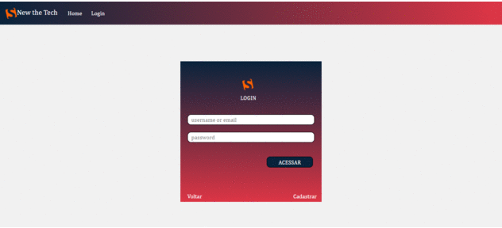
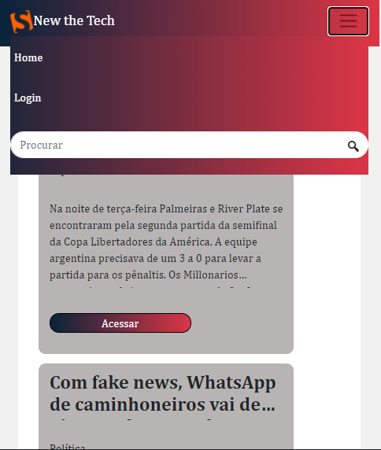
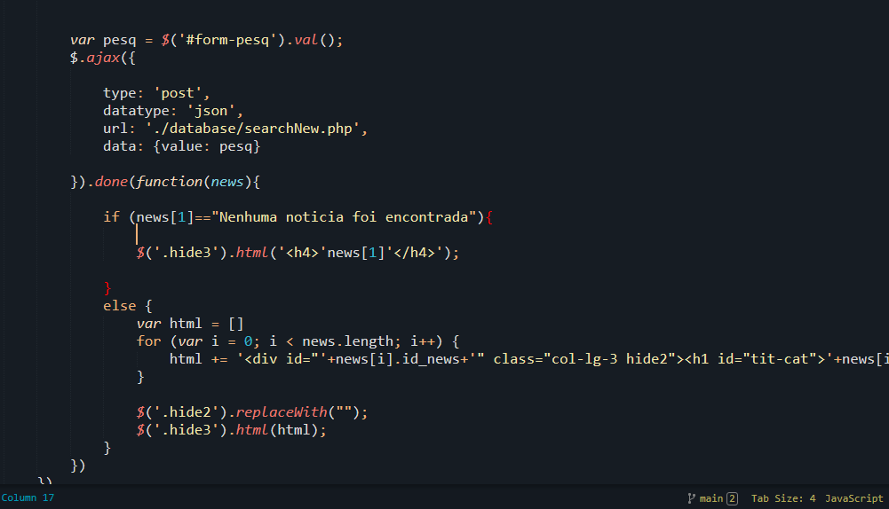
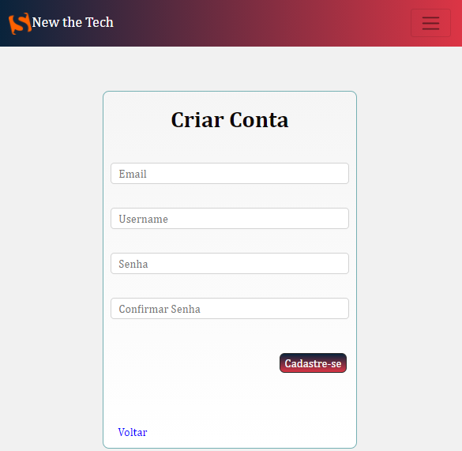
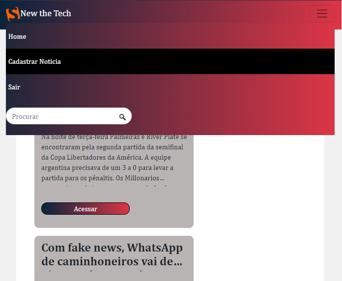
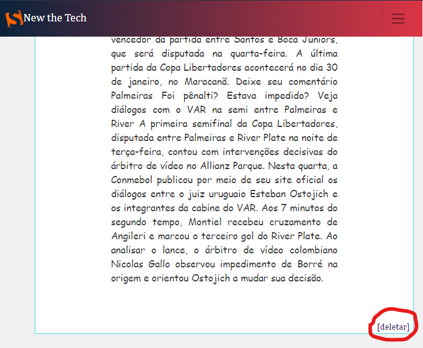

<h1 align="center">
  
</h1>

---

<h1>
  
</h1>

---

# 🔎 Indice

- [Sobre](#-sobre)
- [Tecnologias Utilizadas](#-tecnologias-utilizadas)
- [Instalação](#-instalação)

---

## 📰 Sobre

O **Website  News** é um site de notícias fictício criado com o intuito de colocarmos em prática parte do nosso conhecimento em desenvolvimento web.

#### Detalhes do site

O site por ser rensponsivo, permite que o usuário o acesse por diversos tamanhos de tela, pois seu layout se adequa a qualquer ferramenta utlizada.

<h1>
  
</h1>

Esse sistema de notícias oferece duas hierarquias de acesso: o de leitor e o de colaborador.
O leitor tem apenas  o acesso à leitura das notícias já cadastradas, enquanto o colaborador tem a poder de cadastrar uma nova notícia ou deletar alguma notícia já cadastrada.

<h1>
  
</h1>

Para conseguir privilégios de colaborador é bastante simples: basta criar uma conta no site e fazer o login.

<h1>
	
</h1>

Logo após o login todas as funcionalidades disponíveis para colaboradores são liberadas.

<h1>
	
</h1>

<h1>
	
</h1>

---

## 🔧 Tecnologias Utilizadas

O projeto foi desenvolvido com as seguintes tecnologias:

- HTML
- CSS
- [Bootstrap](https://getbootstrap.com/)
- [Ajax](https://api.jquery.com/jquery.ajax/)
- [PHP](https://php.net)
- [MariaDB](https://mariadb.org/)

---

## ⚙ Instalação

Para a correta utilização deste site é necessário que seu computador tenha em sua máquina
-  PHP 7.0.0 ou superior
- Sistema gerenciador de Banco de Dados MariaDB

